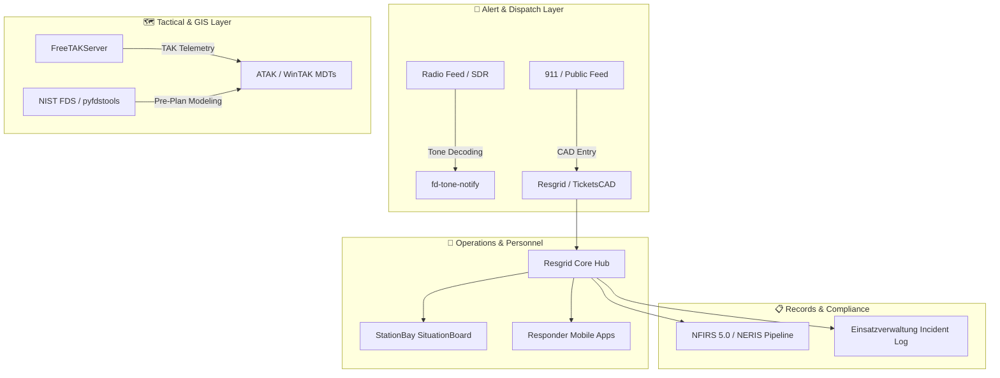

  

# 🚒 Awesome Fire Department Management

  
  
  
  
  
  

> 🚨 **A curated index of leading SaaS platforms and open-source GitHub repositories for Fire Department Management, Computer-Aided Dispatch (CAD), Records Management Systems (RMS), First Responder Scheduling, NFIRS / NERIS Compliance, and Situational Awareness.**

---

## 📑 Table of Contents

- [🌟 Overview & SEO Taxonomy](#-overview--seo-taxonomy)
- [🏢 SaaS / Hosted Platforms](#-saashosted-platforms)
- [💻 Open-Source GitHub Projects](#-open-source-github-projects)
- [🛠️ Key Architectural Patterns & Self-Hosting](#️-key-architectural-patterns--self-hosting)
- [🤝 How to Contribute](#-how-to-contribute)
- [📈 Star History](#-star-history)
- [🛡️ Disclaimer](#️-disclaimer)

---

## 🌟 Overview & SEO Taxonomy

Modern fire departments, emergency medical services (EMS), and rescue squads require reliable software architectures to maintain operational readiness, track apparatus and inventory, coordinate multi-agency dispatches, and ensure strict state and federal compliance.

This repository tracks premier **commercial SaaS solutions** and active **open-source software** tailored for:
* 🚒 **Fire RMS & Incident Reporting:** Run records, NFIRS 5.0, and modern **NERIS** (National Emergency Response Information System) migration.
* 🚨 **Computer-Aided Dispatch (CAD):** Real-time 911 dispatch, call logging, live mapping, and Automated Vehicle Location (AVL).
* 👨‍🚒 **Personnel & Shift Scheduling:** Volunteer availability, career shift rotations, certifications, and payroll integration.
* 📦 **Asset & Apparatus Management:** Fleet telematics, narcotics control, checklist inspections, and equipment maintenance.
* 🗺️ **Situational Awareness & GIS:** Tactical pre-incident planning, hydrant mapping, TAK server integrations, and fire spread simulations.

---

## 🏢 SaaS/Hosted Platforms

The commercial SaaS fire software landscape includes enterprise suites and specialized modular tools. The table below is ranked in descending order by **Company Scale (Estimated Annual Revenue / Valuation)**:

| 🏢 Platform | 📝 Description & Primary Focus | 📈 Company Scale (Revenue / Valuation) | 💰 Starting Pricing | 🆓 Free Tier / Free Trial Limits |
| :--- | :--- | :--- | :--- | :--- |
| **[ESO Fire RMS](https://www.eso.com/)** | Comprehensive fire and EMS records management, incident reporting, analytics, and operational tools used by 13,000+ public safety agencies. | **~$248.5M ARR** / **$1B+ Valuation** *(Backed by Vista Equity Partners & Accel-KKR)* | Starts at ~$3,500 – $5,000/year *(base tier; scales by call volume and selected modules)* | No free tier or public trial *(0 days; live guided demo available upon request)* |
| **[Vector Solutions / TargetSolutions](https://www.vectorsolutions.com/)** | Comprehensive public safety training, compliance, workforce management, and emergency personnel scheduling suite. | **~$183.8M Revenue** / **$1B+ Valuation** *(Backed by Genstar Capital & Insight Partners)* | Starts at ~$25 – $40/user/year *(Volunteer Edition packages from ~$1,200/year; Vector Scheduling module from ~$3–$5/user/month)* | 30-day free trial *(available for Vector Scheduling module; full platform offers guided demo & free Vector Cares courses)* |
| **[ImageTrend Elite](https://www.imagetrend.com/)** | AI-assisted fire and EMS cloud platform covering incident reporting, inspections, pre-plans, scheduling, and compliance analytics. | **~$25M – $72M ARR** / **$250M+ Valuation** *(Backed by Welsh, Carson, Anderson & Stowe)* | Starts at ~$5,000 – $10,000/year *(Essential tier; enterprise deployments scale to $15,000+/year)* | No free tier or self-service trial *(0 days; sales consultation and live demo on request)* |
| **[Emergency Reporting](https://emergencyreporting.com/)** | Cloud-based fire department records management and NFIRS reporting software widely used for run reporting and operational accountability. | **~$15M Historical ARR** *(Part of ESO Suite: ~$248.5M scale)* | Starts at ~$850/month (~$10,200/year base tier; volunteer agency packages from ~$1,500 – $3,000/year)* | No free tier or public trial *(0 days; guided product demo on request)* |
| **[First Due](https://www.firstdue.com/)** | All-in-one fire and EMS platform focusing on pre-incident planning, mobile response, community connect, and operational readiness tools. | **~$11.8M ARR** / **$356M Total Funding Raised** | Starts at ~$3,000 – $6,000/year base subscription *(typical implementations $5,000 – $20,000/year depending on modules/stations)* | No free tier or public trial *(0 days; interactive product walkthrough and demo on request)* |
| **[Firehouse Software](https://www.firehousesoftware.com/)** | Long-standing legacy fire records management and incident reporting system. | **Legacy Tier** *(Part of ESO Suite: ~$248.5M scale)* | Originally ~$1,200 – $2,500/year base licensing *(legacy product transitioned to ESO Fire RMS pricing)* | No free tier or trial *(0 days; legacy software transitioned to ESO platform)* |
| **[FirePrograms](https://www.fireprograms.com/)** | Fire department management software covering modular records, NFIRS/NERIS reporting, inspections, and administrative functions. | **~$1.4M – $5.0M Est. Revenue** *(Private)* | SceneConnect starts at $1,032/year *(+$525 setup)*; Station Manager starts at $2,071/year *(+$705 setup)* | No free tier or trial *(0 days; live product demonstration available upon request)* |
| **[Operative IQ](https://www.operativeiq.com/)** | Public safety operations software specializing in inventory management, asset tracking, fleet maintenance, narcotics control, and RFID tracking. | **~$1.6M Est. Revenue** *(Bootstrapped)* | Starts at ~$185/month (~$2,220/year for core inventory/operations module)* | No free tier or trial *(0 days; personalized live demo available upon request)* |
| **[StreetWise CAD](https://www.streetwisecad.com/)** | In-vehicle computer-aided dispatch, response mapping, tactical pre-planning, and mobile incident coordination. | **~$1.0M – $2.0M Est. Revenue** *(Private / Hangar 14 Solutions)* | Starts at $180 – $210/apparatus/year *(Companion responder smartphone app at $36/user/year or $3/month)* | No self-service trial *(0 days; free live interactive web-based video demo available upon request)* |
| **[StationSmarts](https://www.stationsmarts.com/)** | Fire department management focused on scheduling, incident logging, certifications, apparatus maintenance, and compliance tracking. | **~$440K Est. ARR** *(Bootstrapped)* | Starts at ~$3,000 – $10,500/year *(includes legacy data migration and full 1-year 100% money-back satisfaction guarantee)* | 365-day 100% money-back satisfaction guarantee *(no standalone free trial, 0 days; interactive demo on request)* |

---

## 💻 Open-Source GitHub Projects

Explore the strongest open-source Computer-Aided Dispatch (CAD), Records Management Systems (RMS), situational awareness hubs, tone notification engines, and computational fire modeling tools. 

The list below is ordered in descending order by **GitHub Star Count**:

1. **[FreeTAKTeam / FreeTakServer](https://github.com/FreeTAKTeam/FreeTakServer)**   
   An open-source, self-hosted Situational Awareness Server compatible with Team Awareness Kit (TAK) and ATAK/WinTAK/WebTAK clients. Widely used for tactical mapping, first responder geolocation, drone telemetry streaming, and cross-agency incident coordination.

2. **[firemodels / fds](https://github.com/firemodels/fds)**   
   The official NIST Fire Dynamics Simulator (FDS) computational fluid dynamics (CFD) model of fire-driven fluid flow. Essential for fire safety engineering, structural fire propagation analysis, forensic arson investigation, and ventilation training simulations.

3. **[Resgrid / Core](https://github.com/Resgrid/Core)**   
   Complete open-source Computer Aided Dispatch (CAD), personnel management, shift scheduling, Automated Vehicle Location (AVL), and emergency management platform powering Resgrid.com. Built on .NET Core for robust enterprise self-hosting.

4. **[SnailyCAD / snaily-cadv4](https://github.com/SnailyCAD/snaily-cadv4)**   
   A modern, full-featured web-based Computer Aided Dispatch (CAD) and Records Management System (RMS) featuring 911 dispatch consoles, EMS/Fire call creation, unit status boards, citizen databases, and real-time live map tracking.

5. **[ReadyResponder / ReadyResponder](https://github.com/ReadyResponder/ReadyResponder)**   
   A modular local incident management and resource tracking system engineered for local emergency management agencies, CERT teams, and volunteer emergency operations.

6. **[abrain / einsatzverwaltung](https://github.com/abrain/einsatzverwaltung)**   
   Open-source WordPress incident management and public reporting plugin designed for fire departments and rescue services. Enables automatic logging of emergency runs, vehicle assignments, and community debriefings.

7. **[kjdElectronics / fd-tone-notify](https://github.com/kjdElectronics/fd-tone-notify)**   
   Automated two-tone sequential dispatch decoding and notification software. Listens to radio audio feeds via SDR/soundcard, detects department-specific pager tones, records dispatch audio, and pushes instant push notifications and audio clips to responder phones.

8. **[sahana / eden](https://github.com/sahana/eden)**   
   The Sahana Eden Open Source Humanitarian and Disaster Management Platform. Features adaptable modules for disaster response, emergency volunteer registries, incident command tracking, shelter management, and supply chain logistics.

9. **[johodges / pyfdstools](https://github.com/johodges/pyfdstools)**   
   Python package for programmatic generation, batch preprocessing, and post-processing analytics of NIST Fire Dynamics Simulator (FDS) and Smokeview simulations.

10. **[SituationBoard / SituationBoard](https://github.com/SituationBoard/SituationBoard)**   
    Real-time alarm and status display monitor engineered for firehouse station bay walls. Automatically visualizes incoming CAD dispatches, responding vehicle statuses, weather warnings, and turn-out timers.

11. **[Resgrid / Dispatch](https://github.com/Resgrid/Dispatch)**   
    Dedicated high-speed CAD dispatch application built for dispatch operators and 911 centers to rapidly generate calls, assign units, and stream status telemetry.

12. **[openises / TicketsCAD](https://github.com/openises/TicketsCAD)**   
    Open ISES Tickets CAD is a proven keyboard-first Computer-Aided Dispatch system built for volunteer fire departments, search & rescue teams, and auxiliary emergency radio communications (ARES/RACES).

13. **[saulm / firedeptmanagement](https://github.com/saulm/firedeptmanagement)**   
    Web-based fire department administration suite developed and tested for university and volunteer corps, managing station personnel, daily logs, and apparatus assignments.

14. **[andyyrv2020 / FireDepartmentApp](https://github.com/andyyrv2020/FireDepartmentApp)**   
    ASP.NET Core web platform designed to manage fire department operations, responder duty rosters, asset inventories, and incident logs.

15. **[hallcode / cad-dispatcher](https://github.com/hallcode/cad-dispatcher)**   
    Laravel-based CAD emergency dispatch framework for unit dispatching, incident tracking, and status monitoring.

---

## 🛠️ Key Architectural Patterns & Self-Hosting

For volunteer, rural, and budget-conscious fire agencies, combining modular open-source components provides enterprise-grade capabilities with zero recurring license costs:

---

## 🤝 How to Contribute

Contributions are welcome! If you know of an active open-source fire software project or an established SaaS solution:

1. 🍴 **Fork** this repository.
2. ✏️ **Add/edit** entries in [`README.md`](./README.md) following the existing format.
3. 🔗 **Include**: platform/repo name, official URL, 1–2 sentence description, star badge (for repos), and verified pricing/revenue data.
4. 🚀 **Submit a Pull Request** with a brief summary of the changes.

---

## 📈 Star History

---

## 🛡️ Disclaimer

- This repository is a **community-curated index** and does not constitute an endorsement.
- Emergency management and life-safety systems require strict testing, reliable hardware redundancy, secure backups, and validation against federal standards (**NFIRS 5.0**, **NERIS**, and local state reporting mandates).
- Always verify public-safety technology integrations with qualified municipal advisors and local mutual-aid coordinators.

---

  <b>Built with ❤️ for Fire Chiefs, Officers, Dispatchers, and Volunteer Firefighters worldwide.</b>

